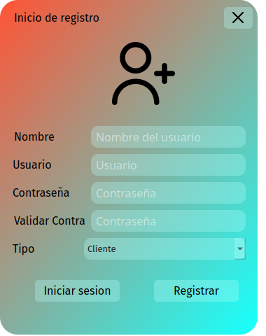
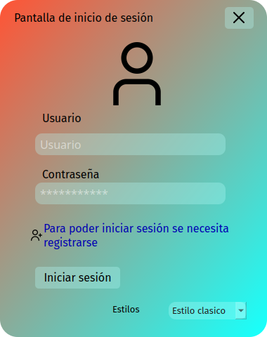
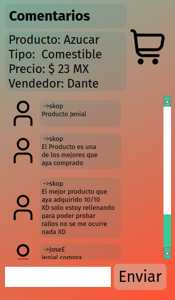
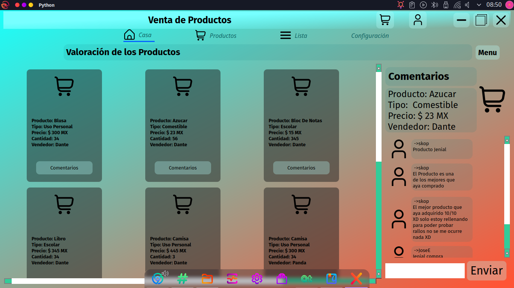

# Aplicacion Punto de Venta

Esta abplicación fue crada para visualizar los productos las ventas los precios o compras 
cada compra lo puede balorar el usuario ademas que su busqueda facilita su uso

---
## Creacion de Un usario y inicio de sesión
Para la creación de un usuario se manda a llamar al widget user 
que se encuantra en el archivo User.py
La iformacion se guarda en `self.dato` por defecato el valor es 0
```
    def InfoDelUser(self):#para la tratar con la informacion del usuario
        self.user.exec()#executa el widget para el usuario
        if self.dato!=self.user.data:
            self.eliminarCompras()
            self.Ticket.elimiarCompras()
        self.dato=self.user.data#gurda la informacion del usuario
        if self.dato!=0:
            self.PrinWin.pushButton.setText(self.dato[1])
            #si el usuario es un vendedor abre el menu para crear productos o eliminarlos
            if self.dato[3]=="Vendedor":
                self.PrinWin.stackedWidget.setCurrentIndex(1)
                self.PrinWin.pushButton_13.setEnabled(False)
                with open("CSS/stylesMenuPrinw.css","r") as f:
                    self.PrinWin.pushButton_13.setStyleSheet(f.read())
                self.PrinWin.pushButton_13.setText("")
                if self.PrinWin.tabWidget.currentIndex()==1:
                    self.botonesDeProduct(self.PrinWin.widget_6,None)
                else:
                    self.botonesDeProduct(self.PrinWin.Casa,None)
            #si el usuario es cliente abre la lista de productos 
            elif self.dato[3]=="Cliente":
                self.PrinWin.stackedWidget.setCurrentIndex(0)
                if self.PrinWin.tabWidget.currentIndex()==1:
                    self.botonesDeProduct(self.PrinWin.frame_8,None)
                else:
                    self.botonesDeProduct(self.PrinWin.Casa,None)
        else:
            self.PrinWin.stackedWidget.setCurrentIndex(0)
            if self.PrinWin.tabWidget.currentIndex()==0:
                 self.botonesDeProduct(self.PrinWin.Casa,None)
            elif self.PrinWin.tabWidget.currentIndex()==1:
                self.botonesDeProduct(self.PrinWin.frame_8,None)
            self.PrinWin.pushButton.setText("")#si el usuario cerro secion se elimina la informacion gurdada y se refleja en este boton
        self.MensajeDeProduc()#actializa los mensajes

```
> En el anterior codigo se guarda la informacion del usuario o lo convierte en 0
## Regitro

### inicio de sesión 

---
## Tipo de usuario
> Solo existen dos tipos de usuarios vendedor o cliente
---
## Valoración
    Cada usario puede dejar un mensaje como se puede observar en la siguiente imagen
    hay dos tipos de mensajes 

> Tipo 1 Mensajes del propietario del mensaje
> Tipo 2 Mensajes de otros usarios

Los tipos de Mensajes se definen en el siguiente parte del codigo
```
    def MensUser1(self,widget,texto):
        Layout1 = QGridLayout(widget)
        Layout1.setObjectName(u"gridLayout")
        Textouser1 = QLabel(widget)
        Textouser1.setObjectName(u"label_3")
        Textouser1.setScaledContents(True)
        Textouser1.setAlignment(Qt.AlignLeading|Qt.AlignLeft|Qt.AlignTop)
        Layout1.addWidget(Textouser1, 0, 0, 1, 1)
        IconUser1 = QToolButton(widget)
        IconUser1.setObjectName(u"IconUser1")
        icon = QIcon()
        icon.addFile(u":/ICONS/usuario.png", QSize(), QIcon.Normal, QIcon.Off)
        IconUser1.setIcon(icon)
        IconUser1.setIconSize(QSize(50, 50))
        Layout1.addWidget(IconUser1, 0, 1, 1, 1)
        Textouser1.setText(texto)

    def Mensuser2(self,widget,texto2):
        Layout = QGridLayout(widget)
        Layout.setObjectName(u"gridLayout_2")
        IconDeUser = QToolButton(widget)
        IconDeUser.setObjectName(u"toolButton_2")
        icon = QIcon()
        icon.addFile(u":/ICONS/usuario.png", QSize(), QIcon.Normal, QIcon.Off)
        IconDeUser.setIcon(icon)
        IconDeUser.setIconSize(QSize(50, 50))
        Layout.addWidget(IconDeUser, 0, 0, 1, 1)
        TextoMens = QLabel(widget)
        TextoMens.setObjectName(u"label_3")
        TextoMens.setAlignment(Qt.AlignLeading|Qt.AlignLeft|Qt.AlignTop)
        Layout.addWidget(TextoMens, 0, 1, 1, 1)
        TextoMens.setText(texto2)
```
---
## Widget de productos
    Los widgets se observan de la siguiente manera

El widget funciona con geometry  lo que hace geometry es posicionarlo dentro 
del widget seleccionado
 > self.PrinWin.widget_6 vendador
 > self.PrinWin.frame_8 cliente
 > self.PrinWin.Casa Inicio
